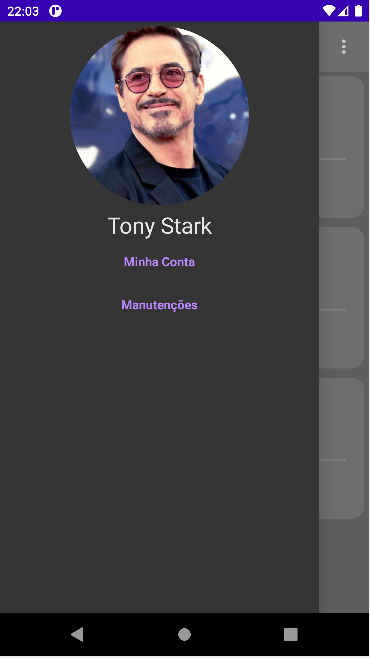
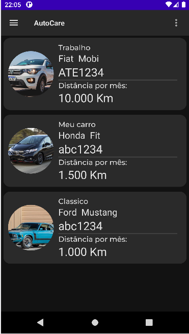
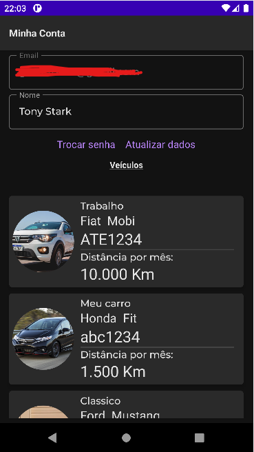
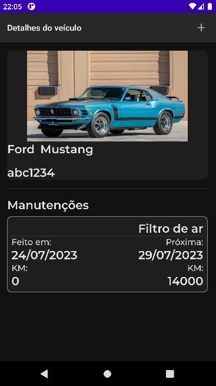
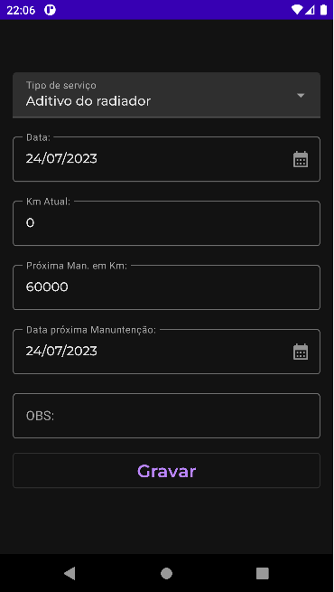

## Aplicativo AutoCare
### Uma maneira simples de fazer o controle de manutenção do seu veículo







## Configuração

O projeto depende de um projeto Firebase (Authentication e Realtime Database).
O armazenamento de imagens **não** usa Firebase Storage — ver *Imagens* abaixo.

1. Crie o projeto no [Firebase Console](https://console.firebase.google.com/) e registre o app
   com o applicationId `br.com.gabrielmorais.autocare`.
2. Baixe o `google-services.json` e coloque-o em `app/google-services.json`.
   **Esse arquivo não é versionado** — sem ele o build falha no plugin `com.google.gms.google-services`.
3. Habilite o provedor *E-mail/senha* em Authentication.
4. Publique as regras de segurança versionadas neste repositório:

   ```sh
   firebase deploy --only database
   ```

   [`database.rules.json`](./database.rules.json) restringe `Usuarios/{uid}` e `vehicles/{uid}`
   ao próprio usuário autenticado e deixa `lista-servicos` como somente leitura.

   > ⚠️ Conceder `".read": "auth != null"` **no nó pai** (`Usuarios`, `vehicles`) expõe os dados
   > de todos os usuários: as regras cascateiam para baixo e não podem ser revogadas no filho.
   > Como o cadastro é self-service, qualquer pessoa cria uma conta e lê o banco inteiro via
   > REST. A permissão precisa ficar no nível `$uid`, como no arquivo versionado.

5. Popule o nó `lista-servicos` do Realtime Database com os tipos de serviço:

   ```json
   {
     "lista-servicos": {
       "0": { "name": "Troca de óleo", "mileageChange": 10000, "mustBeDoneBefore": 12 }
     }
   }
   ```

### Imagens (Cloudinary)

As fotos de perfil e de veículo são hospedadas no [Cloudinary](https://cloudinary.com/) —
o Firebase encerrou o tier gratuito de Storage. O upload é **não assinado**, via
*upload preset*, porque assinar exigiria o `api_secret` no cliente (inaceitável) ou um
backend (o projeto não tem).

Declare as credenciais em `local.properties` — arquivo não versionado:

```properties
cloudinary.cloudName=seu-cloud-name
cloudinary.uploadPreset=seu-preset
```

Sem elas o app compila, mas o upload falha com mensagem explícita apontando para cá.

O preset precisa ser criado como **Unsigned** no console, com estas restrições:

| Configuração | Valor | Por quê |
|---|---|---|
| Folder | `autocare` | Escopo fixo |
| Use filename / Unique filename | `false` / auto | **Ver aviso abaixo** |
| Allowed formats | `jpg, png, webp` | Impede upload arbitrário |
| Max file size | `5 MB` | — |
| Incoming transformation | `c_limit,w_1600,h_1600` | Reduz custo de storage |

> ⚠️ **O `public_id` deve ser gerado pelo Cloudinary.** Se o preset permitir que o cliente
> defina o `public_id`, um atacante pode sobrescrever a imagem de outro usuário passando o
> id dela. Por isso o app não envia esse campo e guarda a `secure_url` retornada.

**Limitações conhecidas deste modelo:**

- O `cloud_name` e o preset são extraíveis do APK — quem fizer isso pode subir imagens
  nesta conta. As restrições do preset limitam o estrago, mas não eliminam o vetor.
- **Não há como deletar** pelo app: a Admin API é assinada. Trocar a foto de perfil ou
  excluir um veículo deixa o asset órfão.

Ambos deixam de valer se algum dia houver um backend para assinar as requisições — nesse
caso só a implementação de `ImageUploader` muda.

O build requer **JDK 17** (AGP 8.0.2).

